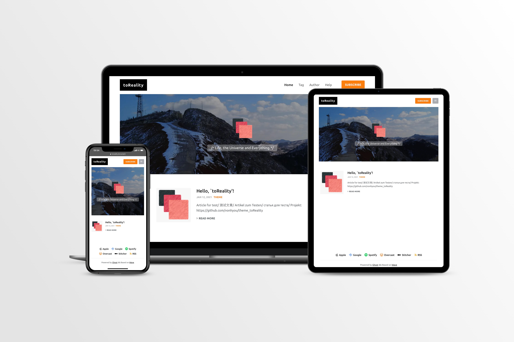

## hello, this is `toReality`


`toReality` is a [ghost](https://github.com/TryGhost/Ghost) theme based on a official theme [`Wave`](https://github.com/TryGhost/Wave). Our theme is under development, feel free to pull request! Thank you～

You can download theme in [release](https://github.com/vonhyou/theme_toReality/releases/latest).

### demo

Here we provide a online [demo](https://toreality.lenva.tech)



### Development

1. Download the theme

2. Install requirements

```bash
$ yarn
```


3. Build & Run while changing

```bash
$ yarn dev
```

Edit file in `/assets/css`, and changes will make on `/assets/build` automatically.

4. Release the theme

```bash
yarn zip
```
